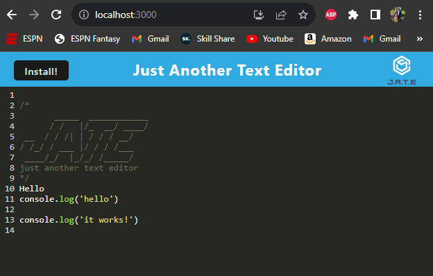

# pwa-text-editor

## Description

This application is a text editor that introduces the use of webpacks and plugins for extra utility. This allows the use of your internets vrowser abilities to store the users data and refresh it to the screen when the application is relaunches. You can even install and remotely use it without connection to your internet. 


## Acceptance Criteria

```md
GIVEN a text editor web application
WHEN I open my application in my editor
THEN I should see a client server folder structure
WHEN I run `npm run start` from the root directory
THEN I find that my application should start up the backend and serve the client
WHEN I run the text editor application from my terminal
THEN I find that my JavaScript files have been bundled using webpack
WHEN I run my webpack plugins
THEN I find that I have a generated HTML file, service worker, and a manifest file
WHEN I use next-gen JavaScript in my application
THEN I find that the text editor still functions in the browser without errors
WHEN I open the text editor
THEN I find that IndexedDB has immediately created a database storage
WHEN I enter content and subsequently click off of the DOM window
THEN I find that the content in the text editor has been saved with IndexedDB
WHEN I reopen the text editor after closing it
THEN I find that the content in the text editor has been retrieved from our IndexedDB
WHEN I click on the Install button
THEN I download my web application as an icon on my desktop
WHEN I load my web application
THEN I should have a registered service worker using workbox
WHEN I register a service worker
THEN I should have my static assets pre cached upon loading along with subsequent pages and static assets
WHEN I deploy to Heroku
THEN I should have proper build scripts for a webpack application
```

## Screenshow

The following animation demonstrates the application functionality:




## Operation

- After loading, you'll notice that a default value has been auto populated to the text editor, this can either be saved or deleted.
- To use the text editor, simply click anywhere within the text field and start typing.
- In order to save the updated characters, click anywhere outside of the text entering space.
- You can now test that it has saved your work by refreshing the webpage.
- If you would like to install the application to your personal hard drive for offline use, click the "Install!" button located in the top left corner.

# Author

https://github.com/Gramer35


https://pwa-assignments-70e42119373a.herokuapp.com/